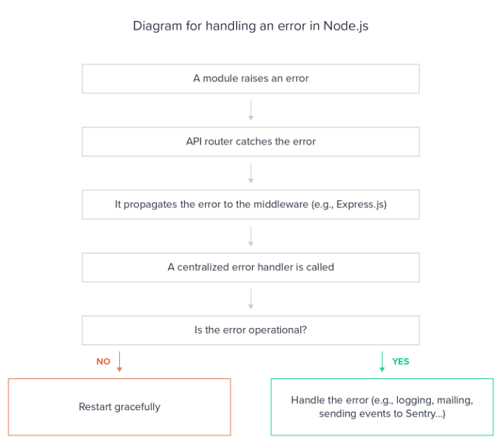

### Centralized Node.js Error-handling

Now, we are ready to build the main component of our Node.js error-handling system: the centralized error-handling component.

Here is a basic workflow for dealing with errors:


errors are caught to transfer to an error-handling middleware.

```ts
try {
  userService
    .addNewUser(req.body)
    .then((newUser: User) => {
      res.status(200).json(newUser);
    })
    .catch((error: Error) => {
      next(error);
    });
} catch (error) {
  next(error);
}

// error handler
app.use(async (err: Error, req: Request, res: Response, next: NextFunction) => {
  if (!errorHandler.isTrustedError(err)) {
    next(err);
  }
  await errorHandler.handleError(err);
});
```

By now, one can imagine what the centralized component should look like because we have already used some of its functions.

```ts
class ErrorHandler {
  // in case of trusted error perform some action but do not exit the process
  public async handleError(err: Error): Promise<void> {
    await logger.error(
      "Error message from the centralized error-handling component",
      err
    );
    await sendMailToAdminIfCritical();
    await sendEventsToSentry();
  }

  public isTrustedError(error: Error) {
    if (error instanceof BaseError) {
      return error.isOperational;
    }
    return false;
  }
}
export const errorHandler = new ErrorHandler();
```

Up to this point, we mostly discussed dealing with operational errors. How about programmer errors? The best way to deal with these errors is to crash immediately and restart gracefully with an automatic restart like PM2—the reason being that programmer errors are unexpected, as they are actual bugs that might cause the application to end up in a wrong state and behave in an unexpected way.

```ts
process.on("uncaughtException", (error: Error) => {
  errorHandler.handleError(error);
  if (!errorHandler.isTrustedError(error)) {
    process.exit(1);
  }
});
```

Last but not least, I am going to mention dealing with unhandled promise rejections and exceptions.
You might find yourself spending a lot of time dealing with promises when working on Node.js/Express applications. It is not hard to see warning messages about unhandled promise rejections when you forget to handle rejections.

The typical error-handling flow might look like the following:

```ts
// somewhere in the code
...
User.getUserById(1).then((firstUser) => {
  if (firstUser.isSleeping === false) throw new Error('He is not sleeping!');
});
...

// get the unhandled rejection and throw it to another fallback handler we already have.
process.on('unhandledRejection', (reason: Error, promise: Promise<any>) => {
 throw reason;
});

process.on('uncaughtException', (error: Error) => {
 errorHandler.handleError(error);
 if (!errorHandler.isTrustedError(error)) {
   process.exit(1);
 }
});
```
